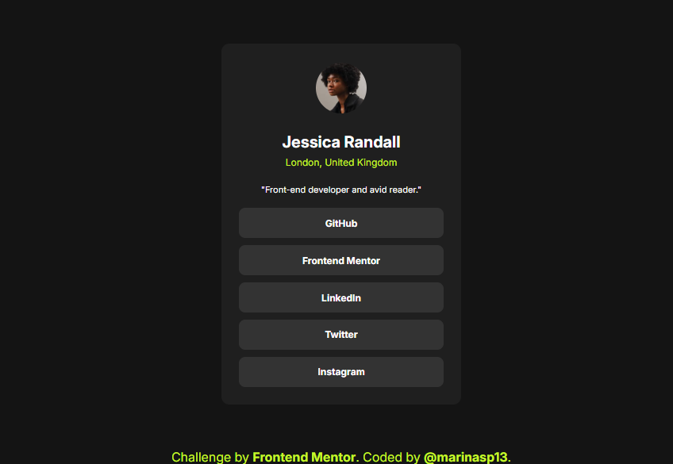

# Frontend Mentor - Social links profile solution

This is a solution to the [Social links profile challenge on Frontend Mentor](https://www.frontendmentor.io/challenges/social-links-profile-UG32l9m6dQ). Frontend Mentor challenges help you improve your coding skills by building realistic projects. 

## Table of contents

- [Overview](#overview)
  - [Screenshot](#screenshot)
  - [Links](#links)
- [My process](#my-process)
  - [Built with](#built-with)
- [Author](#author)

## Overview

### Screenshot

### Links

- Solution URL: [https://github.com/marinasp13/social-link-profile](https://github.com/marinasp13/social-link-profile)
- Live Site URL: [https://marinasp13.github.io/social-link-profile/](https://marinasp13.github.io/social-link-profile/)

## My process

### Built with

- Semantic HTML5 markup
- CSS custom properties
- Flexbox

## Author

<!--- Website - [Add your name here](https://www.your-site.com)-->
- Frontend Mentor - [@marinasp13](https://www.frontendmentor.io/profile/marinasp13)